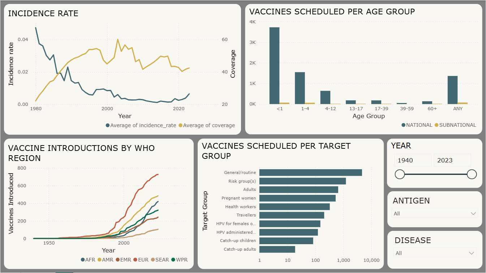

# Vaccination Analysis
    Analysis of vaccination data to create modular dashboard using power BI to show relations, distribution and performance of regions in getting vaccinated

## Workflow
    - Data Cleaning - Null values, inappropriate values etc were removed
    - Pre Processing - Require and use full new columns obtained by from a some available columns.
    - SQL - Data uploaded to PostgreSQL database.
    - Dashboard- Power BI connected with SQL to get data tables, some required tables created with DAX and 2 pages of report made.

## Tools and Libraries used:
    - Python - Data cleaning and Manipulation
    - Postgre SQL - Database
    - Power BI - Dashboard preparation

## Images
    
    
    
# Hi, I'm Udit Pragadeesh! 👋

## 🚀 About Me
Aspiring Data scientist with a background in aeronautical engineering and 2 years’ experience as a design engineer in a manufacturing industry. Skilled in Python programming for machine learning and deep learning. Motivated to apply analytical and problem-solving skills in real-world business challenges. 

## 🛠 Skills
 Python, PyTorch, SQL, Scikit-learn, Matplotlib, MLflow, Seaborn,Power BI, MS Office: Excel, Word, PowerPoint, Six sigma, Problem Solving

